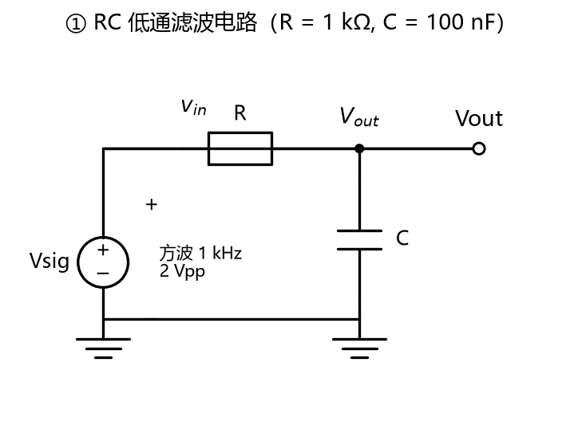
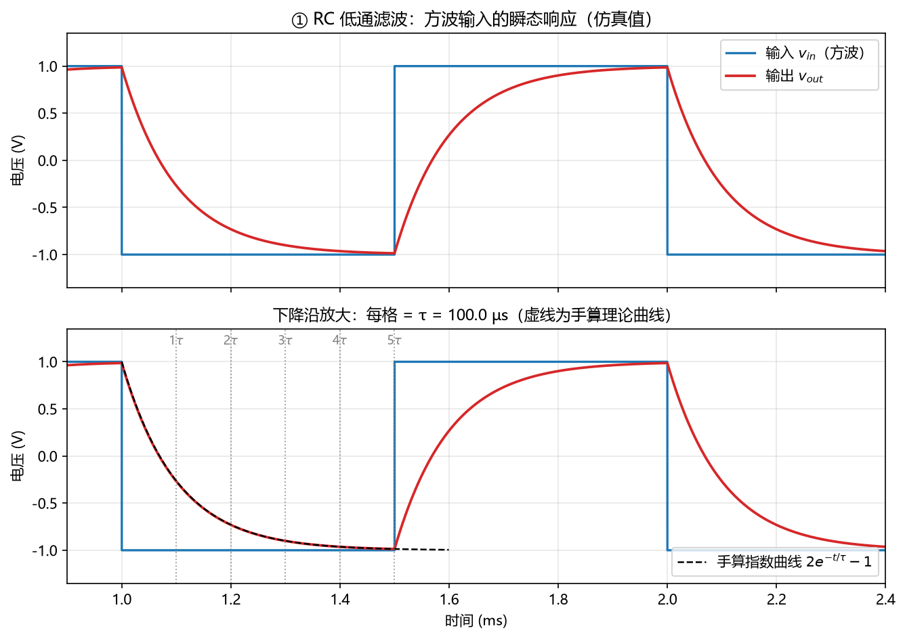
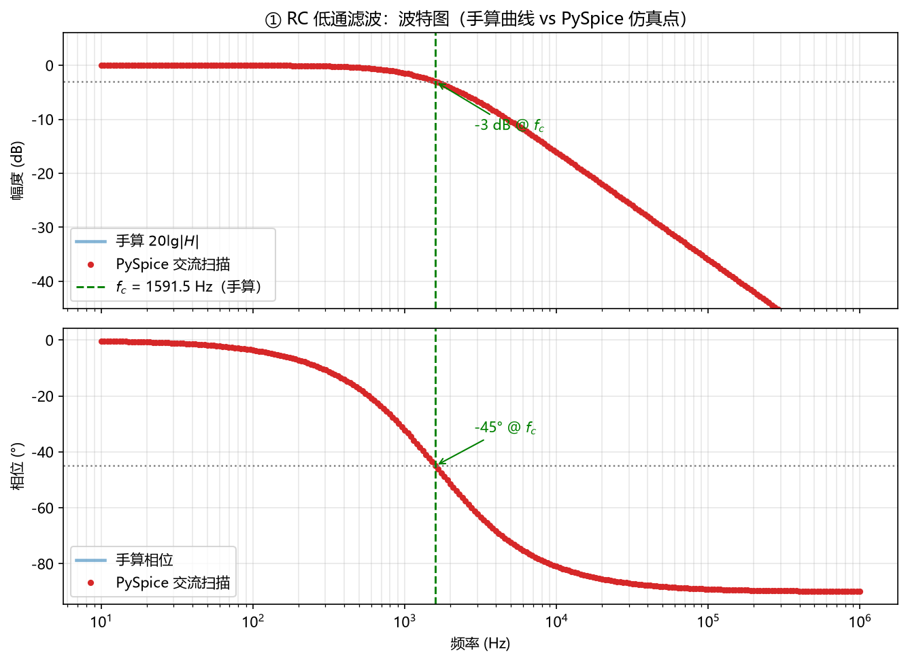

# 进阶挑战 ① —— RC 低通滤波电路

## 一、参数

$$R = 1\ \text{k}\Omega = 1000\ \Omega,\qquad C = 100\ \text{nF} = 100\times10^{-9}\ \text{F}$$

---

## 二、公式与计算

### 1. 时间常数 τ

$$\tau = RC$$

$$\tau = 1000 \times 100\times10^{-9} = 1\times10^{-4}\ \text{s} = 100\ \mu\text{s}$$

### 2. 传递函数

$$H(j\omega) = \frac{1}{1 + j\omega RC},\qquad \omega = 2\pi f$$

### 3. 截止频率 f_c

$$f_c = \frac{1}{2\pi RC}$$

$$f_c = \frac{1}{2\pi \times 1\times10^{-4}} = 1591.55\ \text{Hz}$$

### 4. 幅度与相位

$$|H| = \frac{1}{\sqrt{1+(\omega RC)^2}},\qquad \varphi = -\arctan(\omega RC)$$

$$|H(f_c)| = \frac{1}{\sqrt{2}} = 0.7071 \ \Rightarrow\ -3.01\ \text{dB},\qquad \varphi(f_c) = -45°$$

### 5. 上升时间 t_r

$$v(t) = 1 - e^{-t/\tau}\ \Rightarrow\ t = -\tau\ln(1-x)$$

$$t_{10} = -\tau\ln(0.9) = 0.10536\tau$$

$$t_{90} = -\tau\ln(0.1) = 2.30259\tau$$

$$t_r = t_{90} - t_{10} = \tau\ln 9 = 2.1972\tau$$

$$t_r = 2.1972 \times 100 = 219.72\ \mu\text{s}$$

### 6. 各频点理论值

$$|H(f)| = \frac{1}{\sqrt{1+(2\pi f RC)^2}}$$

| f | ωRC | \|H\| | dB | φ |
|---:|---:|---:|---:|---:|
| 100 Hz | 0.0628 | 0.9980 | −0.02 | −3.60° |
| 1 kHz | 0.6283 | 0.8467 | −1.45 | −32.14° |
| 1591.55 Hz | 1.0000 | 0.7071 | −3.01 | −45.00° |
| 10 kHz | 6.2832 | 0.1572 | −16.07 | −80.96° |
| 100 kHz | 62.832 | 0.0159 | −35.96 | −89.09° |

---

## 三、仿真结果

---

## 四、理论值 vs 仿真值

| 指标 | 手算值 | 仿真值 | 相对误差 |
|---|---:|---:|---:|
| τ (µs) | 100.0000 | 99.9992 | 0.001% |
| f_c (Hz) | 1591.5494 | 1584.8932 | 0.418% |
| t_r (µs) | 219.7225 | 219.0000 | 0.329% |
| f_c 处幅度 (dB) | −3.0103 | −2.9921 | 0.603% |
| f_c 处相位 (°) | −45.0000 | −44.8799 | 0.267% |

---

## 五、误差来源

$$\text{相对误差} = \frac{|\text{仿真值} - \text{手算值}|}{|\text{手算值}|} \times 100\%$$

| 误差项 | 来源 | 公式 |
|---|---|---|
| τ：0.001% | 时间步长离散化 | $\Delta t = 1\ \mu\text{s}$ |
| f_c：0.418% | 交流扫描取点间隔 | $10^{1/50} = 1.0471$（即 4.71% 网格） |
| t_r：0.329% | 时间步长离散化 | $\dfrac{\Delta t}{t_r} = \dfrac{1}{219.72} = 0.46\%$（上限） |

**结论**：加密取点至 2000 点/十倍频程后，f_c 误差降至 **0.041%**。

---

## 六、文件

| 文件 | 说明 |
|---|---|
| `rc_filter.py` | 主程序（手算 + 仿真 + 画图 + 对比表） |
| `schematic.py` | 画电路图的函数库 |
| `bode_points.py` | 导出波特图各频点数值 |
| `check_env.py` | 环境自检 |
| `check_figures.py` | 图片自检 |
| `rc_circuit.png` | 电路图 |
| `rc_transient.png` | 瞬态波形 |
| `rc_bode.png` | 波特图 |
| `输出日志/rc_filter.txt` | 运行输出（含对比表） |
| `输出日志/bode_points.txt` | 波特图各频点输出 |
| `教学笔记_详细版.md` | 详细推导与误差分析（可选阅读） |
| `requirements.txt` | 依赖清单 |
